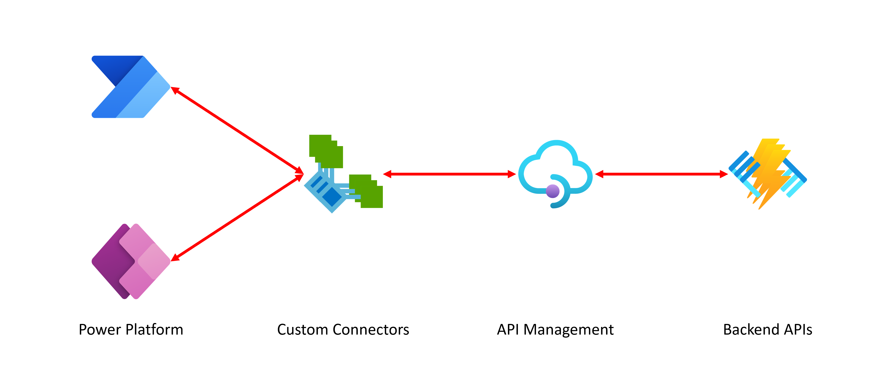

# Infrastructure for Hackers Ground

해커그라운드 운영을 위한 인프라스트럭처 리포지토리입니다

## 전체 아키텍처



## 사전 준비물

- [Visual Studio Code](https://code.visualstudio.com/?WT.mc_id=dotnet-91712-juyoo)
- [애저 구독](https://azure.microsoft.com/ko-kr/free/?WT.mc_id=dotnet-91712-juyoo)
- [애저 CLI](https://learn.microsoft.com/ko-kr/cli/azure/what-is-azure-cli?WT.mc_id=dotnet-91712-juyoo)
- [애저 Dev CLI](https://learn.microsoft.com/ko-kr/azure/developer/azure-developer-cli/overview?WT.mc_id=dotnet-91712-juyoo)
- [GitHub CLI](https://docs.github.com/ko/github-cli/github-cli/about-github-cli)

## 시작하기

1. 자신의 GitHub 계정으로 리포지토리를 포크합니다.
1. 아래 순서대로 명령어를 실행시켜 전체 인프라를 구성합니다.

    ```powershell
    # On PowerShell
    $AZURE_ENV_NAME = "{{애저 리소스 이름}}"
    $AZURE_ENV_INFRA = "{{애저 배포 환경: dev|test|prod}}"
    $AZURE_LOCATION_CODE = "{{애저 리소스 위치 코드: krc}}"
    ```

    ```bash
    # On Bash/Zsh
    AZURE_ENV_NAME="{{애저 리소스 이름}}"
    AZURE_ENV_INFRA="{{애저 배포 환경: dev|test|prod}}"
    AZURE_LOCATION_CODE="{{애저 리소스 위치 코드: krc}}"
    ```

    ```bash
    azd auth login
    azd init -e $AZURE_ENV_NAME
    azd env set AZURE_ENV_INFRA $AZURE_ENV_INFRA
    azd env set AZURE_LOCATION_CODE $AZURE_LOCATION_CODE
    azd up
    ```

1. 아래 순서대로 명령어를 실행시켜 애플리케이션을 배포합니다.

    ```powershell
    $GITHUB_USERNAME = "{{자신의 GitHub ID}}"
    ```

    ```bash
    GITHUB_USERNAME="{{자신의 GitHub ID}}"
    ```

    ```bash
    azd pipeline config

    gh auth login
    gh workflow run "Azure Deployment" --repo $GITHUB_USERNAME/infrastructure
    ```

    > 위의 `gh workflow run ...` 명령어를 실행시킬 때 | 권한 이슈가 나오는 경우 (예: `Resource not accessible by integration`) | [퍼스널 액세스 토큰](https://docs.github.com/ko/authentication/keeping-your-account-and-data-secure/managing-your-personal-access-tokens)을 사용해 보세요.

## 파워 플랫폼 커스텀 커넥터

파워 플랫폼에서 커스텀 커넥터를 생성해서 사용할 경우 API 구독 키가 필요합니다. 아래 명령어를 통해 구독 키를 받아서 사용하세요.

```powershell
# On PowerShell
az login

$AZURE_RESOURCE_GROUP = "rg-$AZURE_ENV_NAME-$AZURE_ENV_INFRA-$AZURE_LOCATION_CODE"
$AZURE_APIM_NAME = "apim-$AZURE_ENV_NAME-$AZURE_ENV_INFRA-$AZURE_LOCATION_CODE"

$SUBSCRIPTION_NAME = "{{애저 구독 이름}}"
$SUBSCRIPTION_ID = $(az account list --query "[?name == '$SUBSCRIPTION_NAME'].id" -o tsv)
$API_VERSION = "2022-08-01"
$REQUEST_URL = "/subscriptions/$SUBSCRIPTION_ID/resourceGroups/$AZURE_RESOURCE_GROUP/providers/Microsoft.ApiManagement/service/$AZURE_APIM_NAME/subscriptions/default/listSecrets?api-version=$API_VERSION"

$SUBSCRIPTION_KEY = $(az rest -m post --url $REQUEST_URL --query "primaryKey" -o tsv)

$SUBSCRIPTION_KEY
```

```bash
# On Bash/Zsh
az login

AZURE_RESOURCE_GROUP="rg-$AZURE_ENV_NAME-$AZURE_ENV_INFRA-$AZURE_LOCATION_CODE"
AZURE_APIM_NAME="apim-$AZURE_ENV_NAME-$AZURE_ENV_INFRA-$AZURE_LOCATION_CODE"

SUBSCRIPTION_NAME="{{애저 구독 이름}}"
SUBSCRIPTION_ID=$(az account list --query "[?name == '$SUBSCRIPTION_NAME'].id" -o tsv)
API_VERSION="2022-08-01"
REQUEST_URL="/subscriptions/$SUBSCRIPTION_ID/resourceGroups/$AZURE_RESOURCE_GROUP/providers/Microsoft.ApiManagement/service/$AZURE_APIM_NAME/subscriptions/default/listSecrets?api-version=$API_VERSION"

SUBSCRIPTION_KEY=$(az rest -m post --url $REQUEST_URL --query "primaryKey" -o tsv)

echo $SUBSCRIPTION_KEY
```

## Azure OpenAI 프로비저닝

1. 아래 순서대로 명령어를 실행시켜 Azure OpenAI 서비스 인스턴스를 생성합니다.

    ```powershell
    # On Bash/Zsh
    AZURE_ENV_NAME="{{애저 리소스 이름}}"
    pwsh ./infra/New-OpenAIs.ps1 -AzureEnvironmentName $AZURE_ENV_NAME -ModelName {{모델 이름}} -ModelVersion {{모델 버전}}

    # On PowerShell
    $AZURE_ENV_NAME = "{{애저 리소스 이름}}"
    ./infra/New-OpenAIs.ps1 -AzureEnvironmentName $AZURE_ENV_NAME -ModelName {{모델 이름}} -ModelVersion {{모델 버전}}
    ```

   아래는 생성 가능한 모델 목록입니다. **2024년 6월 26일 기준**

   | 모델 이름               | 모델 버전         |
   |:-----------------------:|:-----------------:|
   | gpt-4                   | 0613              |
   | gpt-4                   | 1106-Preview      |
   | gpt-4                   | 0125-Preview      |
   | gpt-4                   | vision-preview    |
   | gpt-4                   | turbo-2024-04-09  |
   | gpt-4o                  | 2024-05-13        |
   | gpt-4-32k               | 0613              |
   | gpt-35-turbo            | 0301              |
   | gpt-35-turbo            | 0613              |
   | gpt-35-turbo            | 1106              |
   | gpt-35-turbo            | 0125              |
   | gpt-35-turbo-16k*       | 0613*             |
   | gpt-35-turbo-instruct   | 0914              |
   | text-embedding-ada-002  | 1                 |
   | text-embedding-ada-002* | 2*                |
   | text-embedding-3-small  | 1                 |
   | text-embedding-3-large  | 1                 |
   | dall-e-2                | 2.0               |
   | dall-e-3                | 3.0               |
   | babbage-002             | 1                 |
   | davinci-002             | 1                 |
   | tts                     | 001               |
   | tts-hd                  | 001               |
   | whisper                 | 001               |

   > 해커그라운드 운영을 위해서는 `*` 마크한 모델을 사용하세요.

1. 아래 명령어를 실행시켜 설치한 인스턴스 정보를 확인합니다. 아래 명령어는 `infra` 디렉토리에 `instances.json` 파일을 생성합니다.

    ```bash
    # On Bash/Zsh
    pwsh ./infra/Get-OpenAIDetails.ps1 -AzureEnvironmentName $AZURE_ENV_NAME
    
    # On PowerShell
    ./infra/Get-OpenAIDetails.ps1 -AzureEnvironmentName $AZURE_ENV_NAME
    ```
